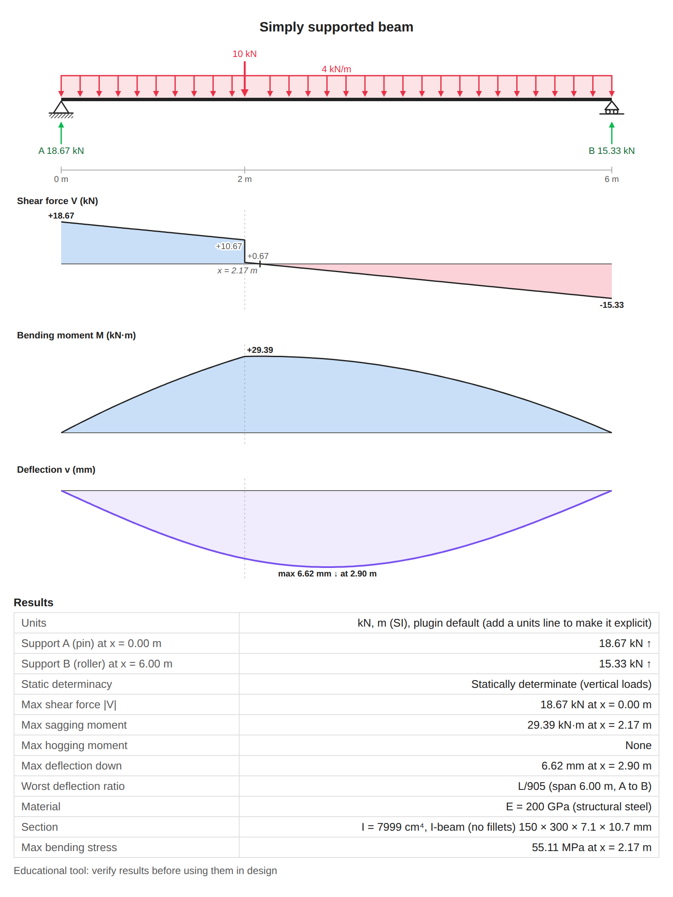
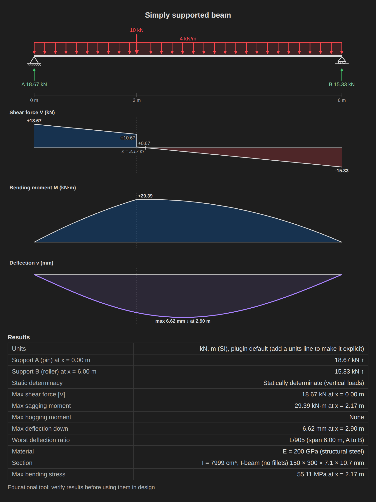
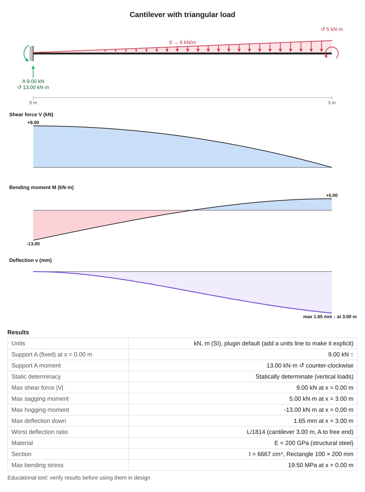
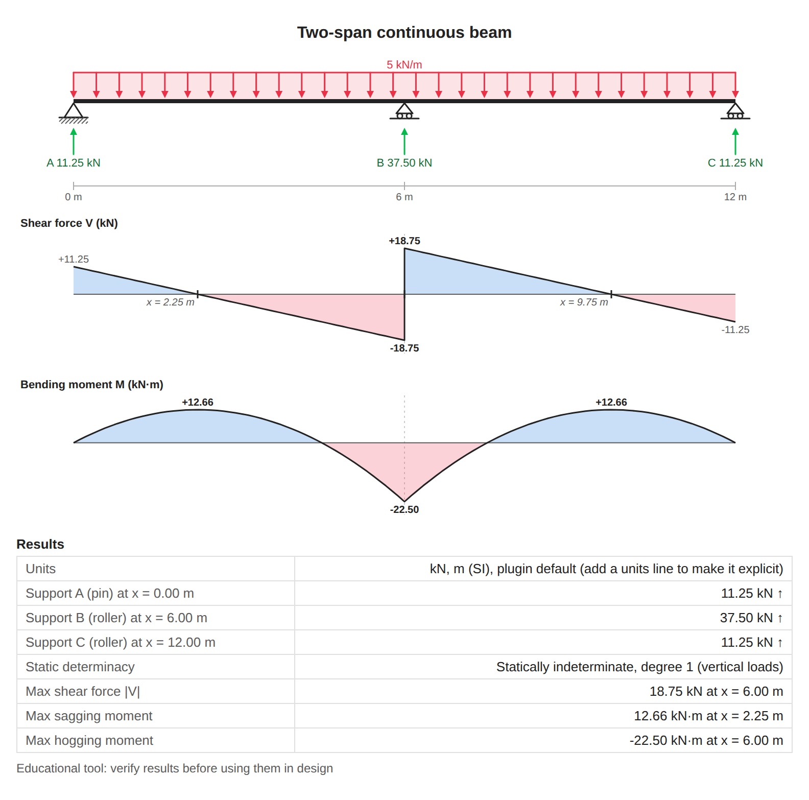
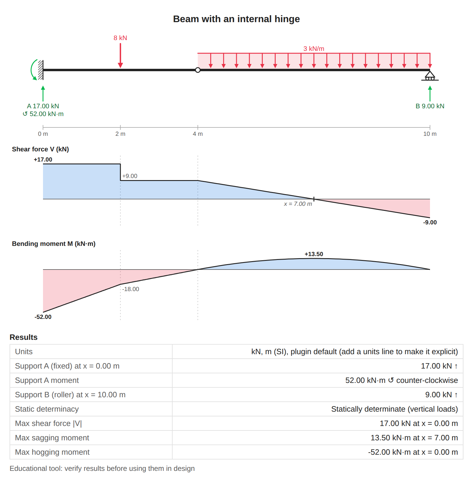
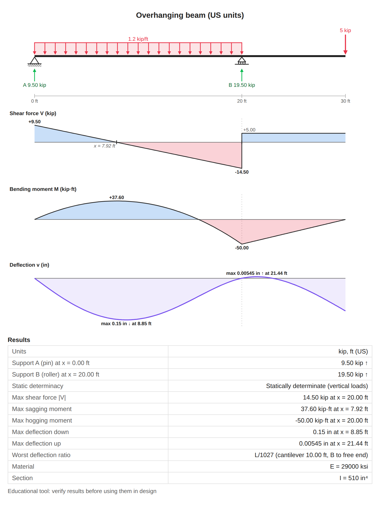

# Beam Statics

Type a beam into a note and get its support reactions, shear force, bending moment and deflection diagrams, computed exactly and drawn as clean SVG. Works offline, on desktop and mobile.



What it does:

- Reads a small `beam` code block (one statement per line, plain English words).
- Solves statically determinate **and** indeterminate beams (continuous beams, propped cantilevers, fixed-fixed beams, beams with internal hinges).
- Draws the beam with its loads and reactions, then the shear, moment and deflection diagrams on the same horizontal scale, labelled with the values at key points, the exact maxima and the positions where the shear changes sign.
- Lists reactions, maximum values, the worst span-to-deflection ratio (L/n, per span and cantilever) and the maximum bending stress in a results table.
- Tells you, with line numbers, what is wrong when a block cannot be solved, including beams that are unstable (mechanisms).

## Contents

- [Features](#features)
- [Installation](#installation)
- [Quick start](#quick-start)
- [Examples](#examples)
- [Syntax reference](#syntax-reference)
- [Sign conventions and how to read the diagrams](#sign-conventions-and-how-to-read-the-diagrams)
- [Materials and sections](#materials-and-sections)
- [Settings](#settings)
- [How it works](#how-it-works)
- [Assumptions and limitations](#assumptions-and-limitations)
- [Privacy](#privacy)
- [Roadmap](#roadmap)
- [Development](#development)
- [Contributing, license and acknowledgements](#contributing)

## Features

| Area | Supported |
| --- | --- |
| Supports | Pin, roller, fixed (clamped), free end (an end with no support), internal hinge |
| Loads | Point force, uniform distributed load, linearly varying load (triangular or trapezoidal), point moment (couple) |
| Outputs | Beam drawing with reactions, shear force diagram, bending moment diagram, deflection diagram, results table, maximum bending stress |
| Beam types | Simply supported, cantilever, overhanging, propped cantilever, fixed-fixed, continuous over any number of supports, Gerber beams with hinges |
| Units | SI (kN and m, or N and mm) and US customary (kip and ft, or lb and in); mix units freely inside one block |
| Editing | Text block with clear error messages, or an interactive editor with a form, a text view and a live preview |
| Platforms | Desktop and mobile; fully offline; light and dark themes; prints and exports to PDF |

The drawings follow your Obsidian theme. Here is the same beam in a dark theme:



## Installation

**From the Community plugins browser** (once the plugin is listed): open **Settings > Community plugins > Browse**, search for **Beam Statics**, select **Install**, then **Enable**.

**Manual install:**

1. Download `main.js`, `manifest.json` and `styles.css` from the [latest GitHub release](https://github.com/lucasmcazelli/obsidian-beam-static-diagram/releases/latest).
2. Copy them into `<your vault>/.obsidian/plugins/beam-statics/` (create the folder if needed).
3. Restart Obsidian, or reload plugins, then enable **Beam Statics** in **Settings > Community plugins**.

**Beta versions** with [BRAT](https://github.com/TfTHacker/obsidian42-brat): install BRAT, choose **Add beta plugin** and enter `lucasmcazelli/obsidian-beam-static-diagram`.

Requires Obsidian 1.13.0 or later.

## Quick start

Create a fenced code block with the language `beam`:

````markdown
```beam
title Simply supported beam
# Bare numbers use the default units (kN and m unless changed)
length 6 m
pin at 0
roller at end
# Point loads point down unless you write "up"
point 10 kN down at 2 m
udl 4 kN/m down from 0 to 6 m
# Material and section turn on the deflection diagram
material steel
section ibeam 150 x 300 x 7.1 x 10.7 mm
```
````

Switch to Reading view or Live Preview and the block renders as the screenshot at the top of this page: reactions of 18.67 kN at A and 15.33 kN at B, a maximum moment of 29.39 kN·m at x = 2.17 m, and a maximum deflection of 6.62 mm at x = 2.90 m, which the results table reports as L/905 for the 6 m span.

Two commands help you start (open the command palette and type "beam"):

- **Insert beam diagram** opens the beam editor with a starter beam. Fill in the form or edit the text, watch the live preview, then select **Insert**.
- **Insert beam block template** inserts a commented starter block at the cursor, for editing as text.

To change a rendered block later, select the **pencil button** at its top left. The editor opens on that block and **Update** writes the new text back into the note.

The beam editor has two tabs showing the same block: **Form** (supports, hinges, loads, material and section as fields, each with add and remove buttons) and **Text** (the raw block). A **Start from example** menu loads any of the built-in examples, and <kbd>Ctrl</kbd>/<kbd>Cmd</kbd> + <kbd>Enter</kbd> submits. Editing with the form rewrites the block in a canonical order and drops comments; the editor warns you before that happens. Closing the editor with unsaved changes asks before discarding them.

The editor always saves a `units` line (the **Default units** setting when the block had none), so the saved block reads the same on every device and after a settings change. In the form, a blank **Dimension unit** means the unit shown in its placeholder, and that unit is written into the block.

## Examples

Each image is the plugin's real output for the block below it, at the default settings.

**Cantilever with a triangular load and an end moment**



```beam
title Cantilever with triangular load
length 3 m
fixed at start
linear 0 to 6 kN/m down from 0 to 3 m
moment 5 kNm ccw at end
material steel
section rect 100 x 200 mm
```

**Two-span continuous beam** (statically indeterminate)



```beam
title Two-span continuous beam
length 12 m
pin at 0
roller at 6
roller at 12
udl 5 kN/m down
```

**Beam with an internal hinge** (Gerber beam)



```beam
title Beam with an internal hinge
length 10 m
fixed at 0
hinge at 4
roller at 10
point 8 kN down at 2
udl 3 kN/m down from 4 to 10
```

**Overhanging beam in US units**



```beam
title Overhanging beam (US units)
units kip ft
length 30 ft
pin at 0
roller at 20 ft
udl 1.2 kip/ft down from 0 to 20 ft
point 5 kip down at end
E 29000 ksi
I 510 in^4
```

## Syntax reference

One statement per line. Keywords are case-insensitive, statements can come in any order, and the parts after a load's value (direction, position) can come in any order too. The full language reference with many more examples is in [docs/syntax.md](./docs/syntax.md).

| Statement | Example | Notes |
| --- | --- | --- |
| `title` | `title Floor joist J1` | Free text shown above the drawing. Optional. |
| `units` | `units kip ft` | `kN m` (default), `N mm`, `kip ft` or `lb in`. Also `SI`, `US`, `imperial`. Sets the unit of bare numbers and of the results. Alias: `unit`. |
| `length` | `length 6 m` | Required. Aliases: `span`, `L`. |
| `pin` | `pin at 0` | Holds the beam vertically, free to rotate. Alias: `pinned`. |
| `roller` | `roller at end` | Holds the beam vertically, free to rotate (and, in a real structure, to slide). |
| `fixed` | `fixed at start` | Holds position and rotation. Aliases: `clamped`, `fix`. |
| `hinge` | `hinge at 4` | Internal hinge: no bending moment is transmitted. Must be strictly inside the beam. |
| `point` | `point 10 kN down at 2 m` | Point force. Direction defaults to `down`. Aliases: `force`, `load`. |
| `moment` | `moment 5 kNm cw at 3` | Point moment (couple). Direction **required**: `cw` or `ccw`. Alias: `couple`. |
| `udl` | `udl 4 kN/m down from 0 to 6 m` | Uniform load. Omit `from ... to ...` to load the whole beam. Aliases: `uniform`, `distributed`. |
| `linear` | `linear 0 to 6 kN/m down from 0 to 3 m` | Linearly varying load: first value at `from`, second at `to`. Aliases: `triangle`, `trapezoid`, `varying`. |
| `material` | `material steel` | Preset modulus E: `steel`, `stainless`, `aluminium` (or `aluminum`), `timber` (or `wood`), `concrete`. |
| `E` | `E 200 GPa` | Young's modulus. A unit is required. Overrides `material`. |
| `I` | `I 8356 cm^4` | Second moment of area. A unit is required. Overrides the `I` of `section`. Aliases: `Ix`, `Iy`, `Iz`. |
| `section` | `section rect 100 x 200 mm` | Shape and dimensions: `rect`, `circle`, `tube`, `box`, `ibeam`. Enables bending stress. |

Supports can also be written `support pin at 0` or `pin support at 0`, and a load keyword may be followed by `load` (`point load 10 kN at 2 m`). `@` can replace `at`, and a `:` or `=` may follow the keyword (`length: 6 m`). Each of `title`, `units`, `length`, `material`, `E`, `I` and `section` may appear only once.

**Positions** are a length (`2`, `2 m`, `1500 mm`, `5 ft`) or a keyword: `start` (or `left`) for x = 0, `mid` (or `midspan`, `mid-span`, `middle`, `center`, `centre`) for x = L/2, `end` (or `right`) for x = L. x is measured from the left end. In `from 2 to 6 ft` the bare `2` borrows the unit of its partner, so it means 2 ft; likewise `linear 2 to 6 kN/m` means 2 kN/m to 6 kN/m.

**Directions**: forces and distributed loads point `down` unless you write `up` (`downward`, `downwards`, `upward` and `upwards` also work). Moments need `cw` (`clockwise`) or `ccw` (`counterclockwise`, `counter-clockwise`, `anticlockwise`, `anti-clockwise`). A negative value flips the direction: `point -10 kN down` is 10 kN up.

**Units** are matched case-insensitively, with or without a space after the number (`10kN` and `10 kN` are the same), and products can be written `kN·m`, `kN*m`, `kN-m`, `kN.m`, `kNm` or `kN m`. Powers can be `cm^4`, `cm4` or `cm⁴`. Two spellings are refused rather than guessed: `mN` and `mPa` (milli units are not supported; write `MN` or `MPa` for mega), and the one-letter kip forms `k`, `k-ft` and `k/ft` in SI blocks, where `10 k` could just as well mean 10 kN.

| Quantity | Accepted units |
| --- | --- |
| Length, positions, section dimensions | `m` (`meter`, `metre`, plurals), `cm`, `mm`, `in` (`inch`, `inches`), `ft` (`foot`, `feet`) |
| Force | `N`, `kN`, `MN`, `lb` (`lbf`, `lbs`), `kip` (`kips`; `k` in US blocks) |
| Moment | `N·m`, `kN·m`, `MN·m`, `N·mm`, `kN·mm`, `MN·mm`, `N·cm`, `kN·cm`, `lb·ft`, `lb·in`, `kip·ft`, `kip·in` (US units also in reverse order, such as `ft·lb`) |
| Distributed load | `N/m`, `kN/m`, `MN/m`, `N/mm`, `kN/mm`, `N/cm`, `kN/cm`, `lb/ft` (`plf`), `lb/in` (`pli`), `kip/ft` (`klf`), `kip/in` |
| Modulus E | `Pa`, `kPa`, `MPa`, `GPa`, `N/m^2`, `kN/m^2`, `N/mm^2`, `MN/m^2`, `kN/mm^2`, `psi`, `ksi`, `Msi` |
| Second moment of area I | `m^4`, `cm^4`, `mm^4`, `in^4` |

A number without a unit takes the default of the unit system in effect (the block's `units` line, or the **Default units** setting):

| Bare number means | `kN m` | `N mm` | `kip ft` | `lb in` |
| --- | --- | --- | --- | --- |
| Length and positions | m | mm | ft | in |
| Force | kN | N | kip | lb |
| Moment | kN·m | N·mm | kip·ft | lb·in |
| Distributed load | kN/m | N/mm | kip/ft | lb/in |
| Section dimensions | unit required | mm | unit required | in |
| E and I | unit required | unit required | unit required | unit required |

Units are required where a bare number is easy to misread: `E` and `I` always, and section dimensions in `kN m` and `kip ft` blocks (where a bare length means m or ft but a section is usually measured in mm or in). Results are shown in the block's system; deflection in mm (SI) or in (US), and stress in MPa, ksi or psi.

**Comments** start with `#` or `//` and run to the end of the line (except on a `title` line, where they are part of the title). **Numbers** use a dot for decimals and no thousands separators: `2,5`, `1,000` and `200 000` are rejected with a hint rather than guessed.

**Errors** are listed above the block with their line number and the offending line, for example `Line 3: Unknown statement "lenght". Did you mean "length"?` or `Line 5: Moment needs a direction: cw or ccw`. All problems are reported at once. Warnings (a support that must resist uplift, a beam on rollers only, a deflection larger than L/50 of a span or cantilever, an E or I so extreme that no deflection can be computed, a beam with no loads yet) appear under the diagrams without blocking the results.

## Sign conventions and how to read the diagrams

You never type a sign convention: loads are described with words (`down`, `up`, `cw`, `ccw`). The results use the common textbook convention (as in the open textbook *Engineering Statics: Open and Interactive*); if your course uses a different one, compare the drawings, not just the signs:

- **x** runs from the left end of the beam to the right.
- **Shear force V** at a section is the sum of the upward forces to the **left** of that section. Reading left to right, the diagram jumps up at an upward force (a reaction), jumps down at a downward point load, and slopes down under a downward distributed load (dV/dx = q, with q positive up).
- **Bending moment M** is positive when **sagging**: the beam curves like a smile, the bottom fibre is in tension and the top in compression. Hogging moments (over interior supports, at fixed ends) are negative. The moment diagram's slope equals the shear (dM/dx = V), so M peaks where V crosses zero. A clockwise applied moment makes M jump up, a counter-clockwise one makes it jump down. M is zero at hinges and at free or pinned ends without an applied moment.
- **Moment diagram orientation**: by default positive (sagging) moment is plotted **above** the axis. The **Moment diagram** setting can draw it on the **tension side** instead, so sagging appears below the axis, as is common in European and Brazilian practice; the diagram title then ends in "tension side". Only the drawing flips; values and signs do not change.
- **Deflection v** is positive **up**, so a beam sagging under gravity loads has negative deflection plotted below the axis, like the real deflected shape. The results table gives the largest downward (and, if any, upward) deflection as a magnitude, for example `Max deflection down: 6.62 mm at x = 2.90 m`, and a separate **Worst deflection ratio** row such as `L/905 (span 6.00 m, A to B)`. The ratio is taken per span (between two supports) and per cantilever (from a support to a free end), because the largest deflection is not always the worst one: a short overhang can fail L/360 while the long span next to it deflects more. A cantilever is measured with its own length, which is stricter than the 2 × length some codes allow; hinges do not split spans. The ratio is rounded down (L/359.6 reads L/359), so it never seems to pass a limit it fails.
- **Reactions** are drawn as arrows below the supports pointing the way the support pushes on the beam, labelled with the support letter and magnitude (`A 18.67 kN`). Fixed-end moments and applied couples are curved arrows with a ↺ (counter-clockwise) or ↻ (clockwise) label. Supports are lettered A, B, C... from left to right, and the results table uses the same letters with ↑ / ↓ arrows.
- Shear and moment areas are blue where positive and red where negative; the deflected shape is purple. On desktop, hover over a load, support or reaction to see a tooltip with its exact value.

The internal sign convention used by the code (forces and q positive up, couples positive counter-clockwise) is documented at the top of [src/core/types.ts](./src/core/types.ts) and in [docs/how-it-works.md](./docs/how-it-works.md).

## Materials and sections

Deflection needs the bending stiffness EI: give a `material` or an `E`, **and** a `section` or an `I`. Bending stress (σ = M·c / I, the largest value along the beam) also needs a `section`, which provides the extreme fibre distance c.

| Preset | Material | E | Source |
| --- | --- | --- | --- |
| `steel` | Structural steel | 200 GPa | AISC 360 (29,000 ksi); EN 1993-1-1 uses 210 GPa, set `E` to override |
| `stainless` | Stainless steel (austenitic) | 193 GPa | Typical grades 304/316; EN 1993-1-4 gives 200 GPa |
| `aluminium` | Aluminium alloy 6061-T6 | 68.9 GPa | ASM: 68.9 GPa (10,000 ksi); Aluminum Design Manual: 10,100 ksi; EN 1999-1-1: 70 GPa |
| `timber` | Softwood timber C24 | 11 GPa | EN 338:2016 class C24, mean modulus E0,mean |
| `concrete` | Concrete C30/37, uncracked | 33 GPa | EN 1992-1-1:2004 Table 3.1, Ecm; cracked sections deflect more |

Material names are case-insensitive; `structural steel`, `stainless steel`, `aluminum` and `wood` also work.

| Shape | Aliases | Dimensions, in this order | I about the horizontal axis | c |
| --- | --- | --- | --- | --- |
| `rect` | `rectangle` | b x h (width, depth) | b·h³ / 12 | h / 2 |
| `circle` | `round`, `solid-circle` | d (diameter) | π·d⁴ / 64 | d / 2 |
| `tube` | `pipe`, `chs` | d x t (outside diameter, wall) | π·(d⁴ - dᵢ⁴) / 64, dᵢ = d - 2t | d / 2 |
| `box` | `rhs`, `shs` | b x h x t (width, depth, wall) | (b·h³ - (b - 2t)(h - 2t)³) / 12 | h / 2 |
| `ibeam` | `i-beam`, `i`, `h`, `wide-flange` | b x h x tw x tf (flange width, depth, web, flange thickness) | (b·h³ - (b - tw)(h - 2tf)³) / 12 | h / 2 |

Dimensions are separated by `x`, `×` or `*`. A unit after the last dimension applies to all of them (`100 x 200 mm`); otherwise each dimension can carry its own unit (`10 cm x 0.2 m`). Bare dimensions are accepted only in `N mm` (mm) and `lb in` (in) blocks.

**Rolled sections:** the `ibeam` formula ignores the root fillets between web and flanges, so it underestimates rolled profiles by a few percent (IPE 300: 7999 cm⁴ computed against 8356 cm⁴ in the catalogue, about 4% less). For rolled sections, keep the `section` line for the depth (used for stress) and add the catalogue value with `I 8356 cm^4`.

**Overrides:** an explicit `E` replaces the material's modulus, and an explicit `I` replaces the I computed from the section (the section still supplies c for stress). Both cases show a short warning so the override is never silent.

## Settings

| Setting | Default | What it does |
| --- | --- | --- |
| Default units | kN, m (SI) | Units of bare numbers, and of the results, for blocks without a `units` line. Options: kN, m (SI); N, mm (SI); kip, ft (US); lb, in (US). |
| Decimal places | 2 | Decimals in diagram labels and the results table (0 to 6). Computed positions keep at least 2 decimals, so a peak at 2.17 m never reads "2 m"; E and I show 4 significant digits. |
| Moment diagram | Sagging positive, drawn above the axis | Or: drawn on the tension side (sagging below). Values and signs are unchanged. |
| Show deflection diagram | On | Draw the deflected shape when the block gives a material or E, and a section or I. |
| Show results table | On | List reactions, maximum values and section data under the diagrams. |

Changes apply immediately to every open beam block.

The same block without a `units` line reads differently on a device with another **Default units** setting: `length 6` is 6 m in one vault and 6 ft in another. The first row of the results table says which units are in effect and flags the plugin default, so add a `units` line to any note you share.

To restyle the drawings, override the `--bsd-*` colour tokens in a [CSS snippet](https://help.obsidian.md/snippets), for example `.bsd-block { --bsd-load: var(--color-orange); }`. The tokens are listed at the top of `styles.css`. `--bsd-paper` is the colour behind the drawing (support fills and label halos use it): set it when a block sits on a coloured background of your own. Callouts are handled automatically.

## How it works

**Why its own solver.** Beam Statics ships a dependency-free direct stiffness solver of a few hundred commented lines instead of a third-party package. That keeps the plugin small and offline, lets it detect unstable beams (mechanisms) explicitly instead of returning meaningless numbers, and means every step can be explained and checked against a hand calculation.

**The method**, for a straight prismatic Euler-Bernoulli beam:

1. **Stability check.** Hinges split the beam into rigid parts; supports and hinges become constraint rows. The beam is stable only if the constraint matrix has full rank, which detects mechanisms that simple counting rules miss. The surplus of rows gives the degree of indeterminacy.
2. **Direct stiffness method.** Nodes sit only at the ends, supports and hinges (two degrees of freedom each: deflection and rotation, with a split rotation at hinges). Loads between nodes enter as exact consistent nodal loads, so the nodal solution is exact.
3. **Reactions** follow from R = K·u - F at the restrained degrees of freedom, followed by a global equilibrium self-check.
4. **Exact V and M by statics.** With the reactions known, the method of sections gives shear and moment as exact polynomials (V up to quadratic, M up to cubic) on every segment between key points.
5. **Slope and deflection** come from integrating M / EI twice along the beam, starting from the stiffness solution at the left end.
6. **Exact extrema.** Maxima are found at the roots of the derivative (V = 0 for M, slope = 0 for deflection), not by sampling, so the reported peak and its position are exact.

The details, with formulas and tolerances, are in [docs/how-it-works.md](./docs/how-it-works.md).

**Validation.** The solver is checked against 23 closed-form textbook cases (simply supported, cantilever, overhang, propped, fixed-fixed, continuous and Gerber beams under point, uniform, triangular, trapezoidal and moment loads), each cross-checked with an independent exact rational-arithmetic solver ([scripts/oracle/beam_exact.py](./scripts/oracle/beam_exact.py)). Property tests on 150 random beams check equilibrium, the jumps at every load, M = 0 at hinges, the differential relations, superposition, mirror symmetry and linearity. In total the suite has **942 automated tests** (`npx vitest run`).

## Assumptions and limitations

Beam Statics is an **educational and checking tool**. Verify results independently before using them in any design; the plugin does no code checks.

- **Euler-Bernoulli theory**: plane sections stay plane, shear deformation is ignored. Short, deep beams deflect more than shown.
- **Prismatic beam**: E and I are constant along the whole length.
- **Linear elastic material and small deflections**: a warning appears when the deflection exceeds L/50 of a span or cantilever.
- **Vertical loads only**: no axial or inclined loads, so horizontal reactions are not computed. A beam on rollers only is accepted (with a warning) because nothing loads it horizontally. For the same reason the static determinacy row counts vertical and rotational restraints only and says so ("vertical loads"): a beam on two pins reads determinate, while textbooks that count the horizontal reactions call it indeterminate to degree 1.
- **Bilateral supports**: every support can pull as well as push. A support that must pull the beam down is flagged so you can provide an anchor.
- **Not yet supported**: spring supports, support settlements, axial loads, variable cross-sections.
- **Size limits** keep a pasted block from freezing Obsidian: at most 50 supports and hinges, 100 loads and 20,000 characters per block, and a length between 1 µm and 100 km.
- **Self-weight is not added automatically**: include it as a `udl` if it matters.
- The `ibeam` shape has no root fillets (see [Materials and sections](#materials-and-sections)). The concrete preset is uncracked.
- Stress is the elastic bending stress σ = M·c / I only: no shear stress, buckling or lateral-torsional buckling.

## Privacy

- No network requests, no telemetry, no ads, no account. Everything is computed on your device and nothing leaves your vault.
- The plugin changes a note only when you ask it to: inserting a block with one of the commands, or saving a block you edited in the beam editor. Saving checks that the block is still exactly what it was when it was drawn. When Obsidian cannot say where a block is (in an embed, a list or a blockquote in Reading view), the block is found by its text, and only if exactly one block in the note matches; otherwise nothing is written and the editor stays open so you can copy the text. A note open in an editor is changed through the editor, so **Undo** works; a note that is not open (an embedded note, for example) is rewritten directly and cannot be undone with Undo. Obsidian stores the plugin settings in the plugin's own `data.json`.
- All drawing uses DOM APIs; no HTML strings are ever parsed, so text in a block cannot inject markup.

## Roadmap

- Hover readout of V, M and deflection at any x
- Spring supports and support settlements
- Axial and inclined loads
- Variable EI (stepped beams)
- Influence lines
- Export a diagram as SVG
- Localisation, including Portuguese

Ideas and requests are welcome in the issue tracker.

## Development

Requires Node.js 22.12 or later.

```bash
npm install        # install the dev toolchain (no runtime dependencies)
npm run dev        # rebuild main.js on every change (clone into <test vault>/.obsidian/plugins/beam-statics, see CONTRIBUTING.md)
npm test           # run the test suite (vitest)
npm run lint       # eslint with eslint-plugin-obsidianmd (CI uses --max-warnings=0)
npm run build      # type-check and build the production main.js
npm run preview    # write preview/index.html: every example in light and dark, plus a live text box
```

`npm run preview` bundles the real renderer for a normal browser, so you can check drawings without Obsidian. It is a development tool only and is not part of the plugin build.

The code is split into `src/core` (parser, units, model, solver: pure TypeScript), `src/render` (scene builders: pure TypeScript), and `src/ui` plus `src/main.ts` (the Obsidian glue). See [CONTRIBUTING.md](./CONTRIBUTING.md) for the architecture and rules.

**Releasing:** see [docs/publishing.md](./docs/publishing.md) for the release workflow and the community directory submission.

## Contributing

Bug reports with the beam block that misbehaves are the most useful contribution. Pull requests are welcome; please read [CONTRIBUTING.md](./CONTRIBUTING.md) first. Security issues: see [SECURITY.md](./SECURITY.md).

## License

[MIT](./LICENSE)

## Acknowledgements

- The sign conventions and terminology follow standard statics textbooks; [Engineering Statics: Open and Interactive](https://engineeringstatics.org) by Daniel Baker and William Haynes (CC BY-NC-SA 4.0) was used as a reference. No text or figures from it are included in this plugin.
- Built on the [Obsidian sample plugin](https://github.com/obsidianmd/obsidian-sample-plugin) and checked with [eslint-plugin-obsidianmd](https://github.com/obsidianmd/eslint-plugin).
